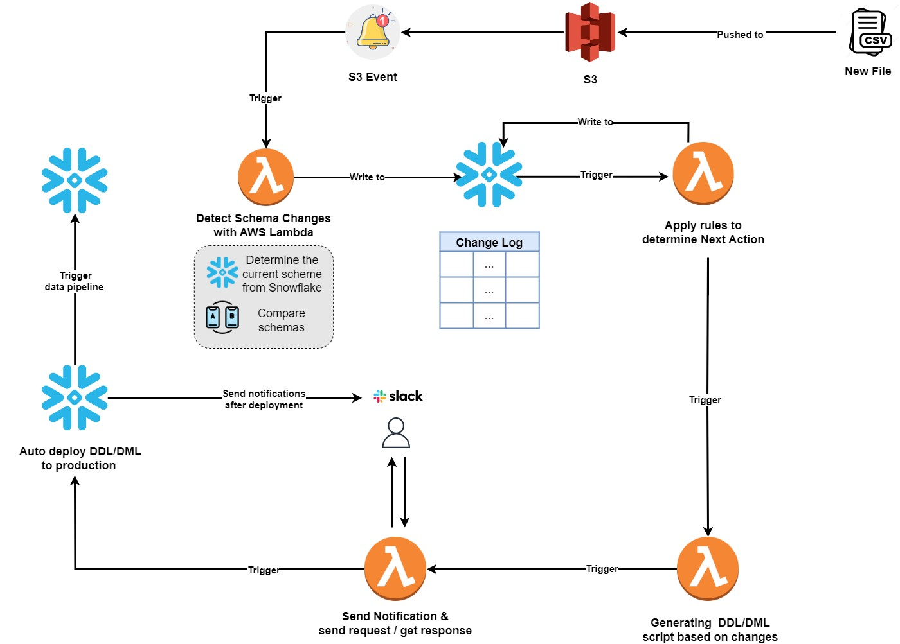
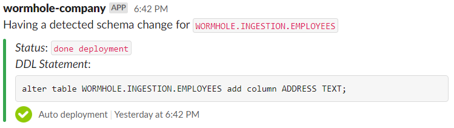
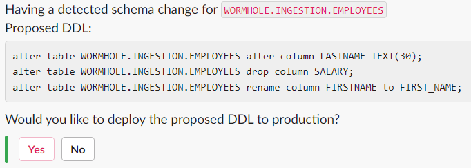
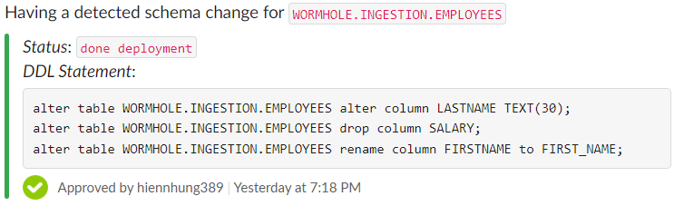
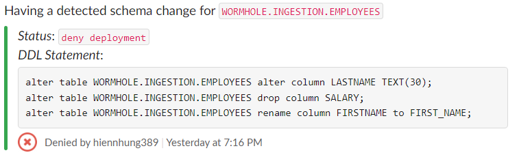

# INTELLIGENT DDL/DML MANAGEMENT
 
Schema Change Detection and Auto Hanfing DDL/DML
 
## A. Overview
 
This repository is built by Wormhole team. Leveraging a powerful AWS infrastructure, Wormhole team brings a solution to identify schema changes across diverse data sources. Once detected, it seamlessly triggers automatic adjustments to process DDL/DML automatically to accommodate evolving schemas.
This intelligent, automated process reduces manual intervention, increases adaptation speed, and ensures continuous data flow with minimal cost investment and high efficiency.
 
## B. Architecture
 

 
1. Auto change detection
   - When a new data file is pushed to S3 bucket, a s3 event will be sent to a lambda that is responsible for detecting Schema Changes based on comparing them and current table schemas.
   - The lambda applies a cleanup rule to normalize column names (remove prefix or suffix) and detect 4 change types: New column added, column removed, column renamed, data type changes. Changes will be stored in a Change log table.
   - Another lambda will determine Next action to resolve changes based on those rules:
 

<table>
    <tr>
        <th>Change type</th>
        <th>Next action</th>
    </tr>
    <tr>
        <th>New column added</th>
        <th>Automatic deployment</th>
    </tr>
    <tr>
        <td>column removed</td>
        <td>Deployment approval required</td>
    </tr>
    <tr>
        <td>Column renamed</td>
        <td>Deployment approval required</td>
    </tr>
    <tr>
        <td>Data type changes</td>
        <td>Deployment approval required</td>
    </tr>
</table>

 
2. Auto-generation DDL/DML: A lambda will auto generation DDL/DML script based on changes to propose for modification.
3. Sending notifications to users/ sending requests or receiving responses
 
   - Automatic deployment cases: a notification will be sent to users after performing production deployment like the below image.
    
   - Deployment approval required cases:
     + Users will receive approval requests in Slack.
       
     + When a user interacts with buttons, the response information will be returned to AWS:
       - Approve: trigger deployment lambda and send user notification after deployment.
         
       - Deny: Only send a notification to users that proposed DDL/DML was denial like the below image.
         
4. Once all issues are resolved, the data pipeline will be triggered to ingest data daily without any errors.
 